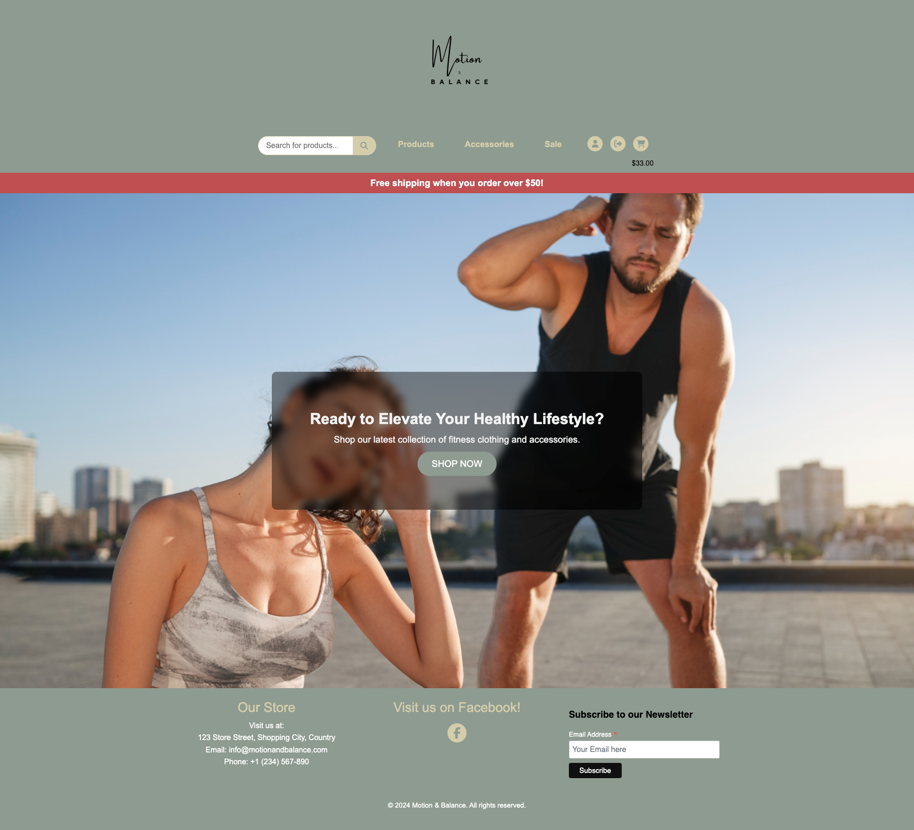
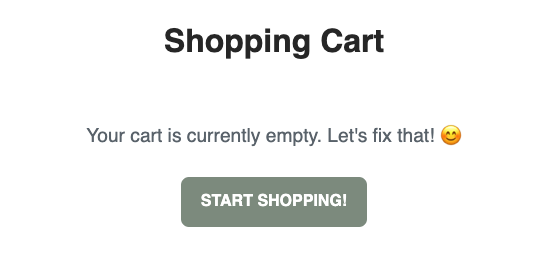

# Features

## Main Features:

Each page has a navbar and a footer

## Navbar:

#### Features of the navbar

- The navbar features the brand log which is custom made piece that reflects the flow in the motion and the structure in the balance.
- Below the logo there is a row featuring a searchbar, 3 nav elements and 3 icons at all times.
- The searchbar queries searches for all products, categories and tags.
- The navelements are responsive to the products meaning that when a product is created, it can be assigned a subcategory that will be displayed in the nav drop down.
- The three icons are responsive in the way that the first icon displays either a sign in, user profile or product management icon depending on what role you enter the site as. The second button is the sign up or sign in. Lastly is the cart which is always displayed with the total of the bag updating as the user ads products.

## Delivery banner

- The deliver banner is displayed across all pages and tells the user how much they can order for to get free shipping.

---

## Home page

### Landing page

- Home page or landing page is essential to grab the user attention, which is why our landing page features a clean and minimalistic look with a brand relevant background image and call to action text.

### Call to action overlay

- The call to action is designed to draw attention to the button telling them to shop now. When the user presses the button they will be redirected to the all products page.

   ---

## Products page

- The products page is designed with simplicity in mind and keeps all the features a user could need in mind. 

- Product details is a must for an ecommerce store as it displays all the details about a product to the user.

- The view of the product details for a user that is signed in.

### Features of the products page

- Product filters work as intended and gives the user the possibility to filter all products by price, discount and rating. These filters are paired with the search queries and makes for powerful filters.

- The pagination works with the 3 product row layout to not overwhelm the user. There can only be 3 products per row on the screen and 2 rows at most, after that the user can press the next button to see more products on another page.

- All of the product cards are styled the same for a standardized look. The cards display what the user needs to know at first glance such as image, title, price, discount, discounted price and average rating. Lastly there is a button for the user to view more. 

- On the profile cards there is a heart icon that functions as a wishlist button. If the user is authenticated and presses the button, it will be added to their wishlist history. If they press it again it will be removed.

- The product feedback view if the user has yet to order a product.

- If the user is authenticated and has order a product they are prompted with a feedback form where they can rate, comment and submit their feedback on a specific product they've ordered.

- When the feedback is submitted the CRUD functionality is avaliable and the user can edit, update and delete their comment and rating.

---

## Cart and checkout

- The shopping cart when an item is added. A user can remove the item that is in the bag, keep shopping or choose to go to the checkout.

- At checkout the user can see all the details about their order in the order summary. In the billing information the user is greeted with a form where they can input their billing and shipping details as well as their card.

### Features of the cart and checkout

- The empty bag features a CTA button that tells the user to keep shopping if the bag is empty.

- The cart features a clear trashcan icon for the user to remove their cart items and 2 big buttons for them to keep shopping or checkout.

---

## User profile

- The user profiles features all the information needed from the website with user profile management in form of first name, last name, address and phone. History view for orders, wishlist and feedback with the feedback having CRUD functionality. 

### Features of the user profile

- The users profile information can be edited here in the view with all the information they will need and a button to submit the form.

- The order history shows the status and details of their order which comes from the backend.

- In the wishlist history the user can see their added wishlist items with two buttons, to remove them or view the product details.

- The feedback history features all the users comments on products and the ability to remove and edit them.

---

## Authentication

- The sign in page is a sign in form from django that is simple and easy to use. The form features 2 inputs for username and password. A remember me checkbox and a sign in button. The user can be directed to reset their password from here or to go to the sign up page.

- The sign up page is simple as well with all the essential inputs to get an account going quick. Enforcing the safety is password validation that is displayed to the user.

- Easy to sign out from 2 button clicks.

- The forgot passsword leads to the password reset. Here the user can enter theyre email and get a reset link.

### Features of the authentication

- Confirmation from the server that the password reset email has been sent.

---

## Footer

### Features of the footer

- The footer has 3 sections, the store info, facebook link and newsletter.
- With the store information the user can find out details about the location and contact information of the business quick and easy.
- The facebook link leads to our business page so that the user can keep up with us as a brand.
- The newsletter provides the user with an email subscription where they can get information about new arrivals, deals and etc.