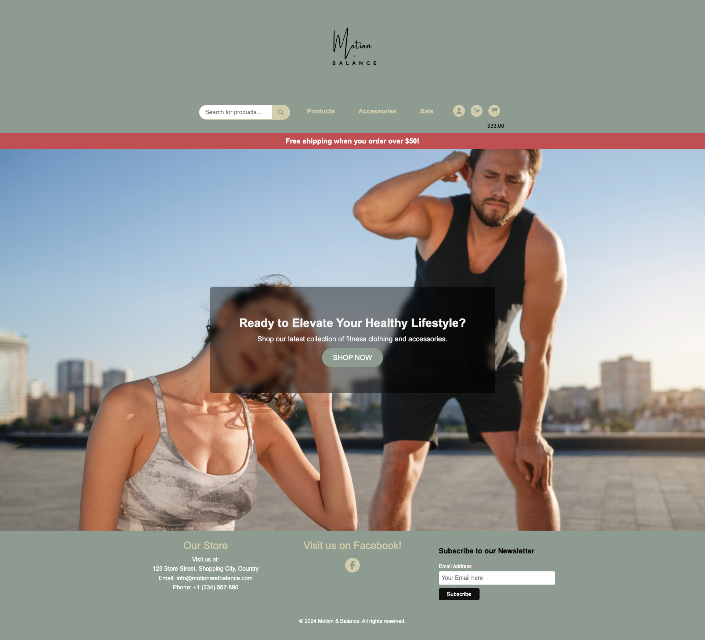
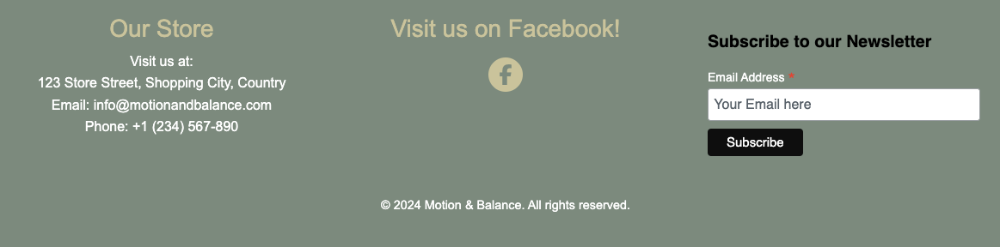
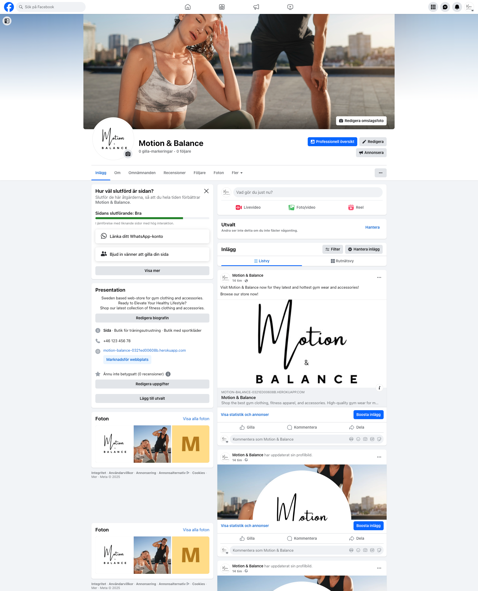
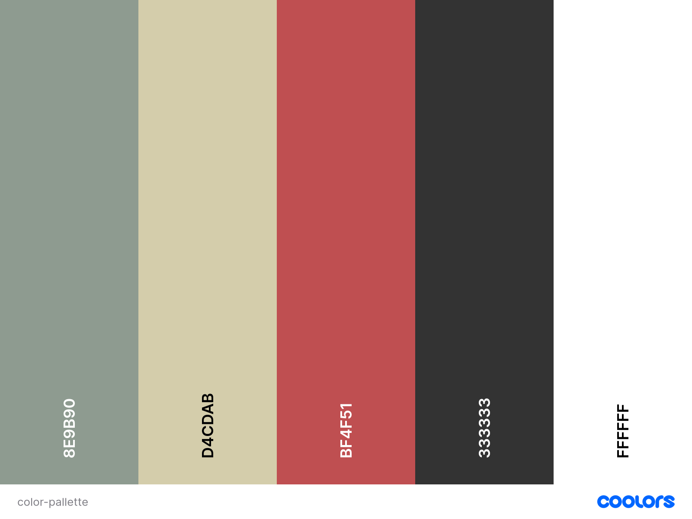
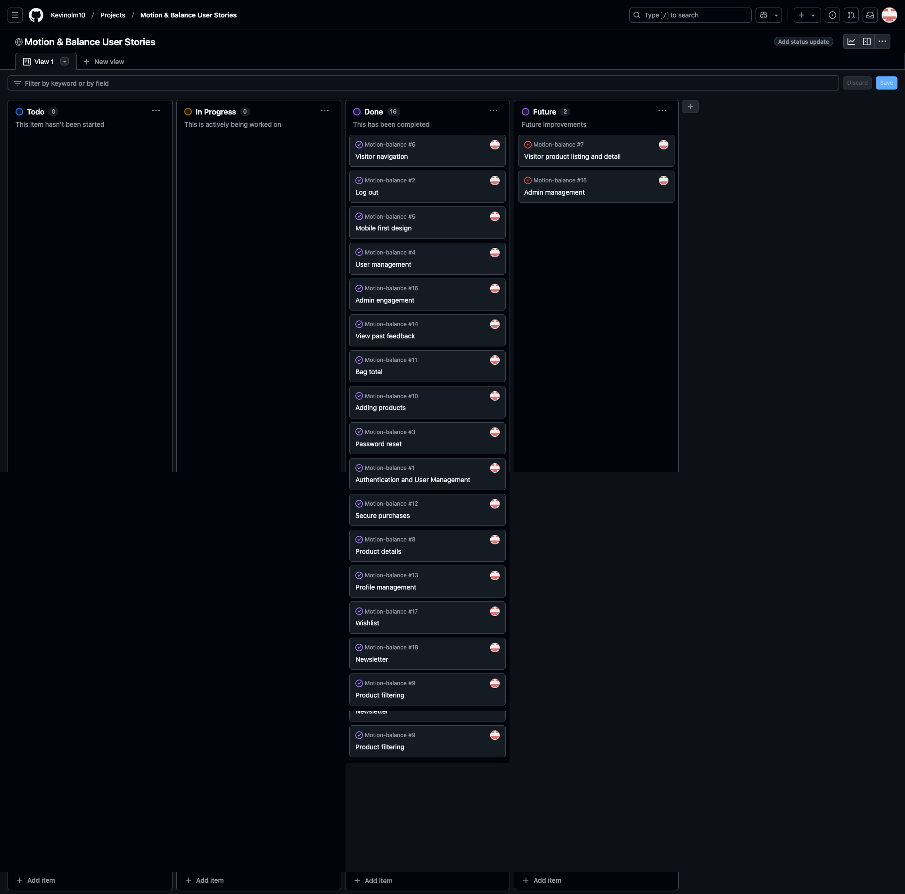
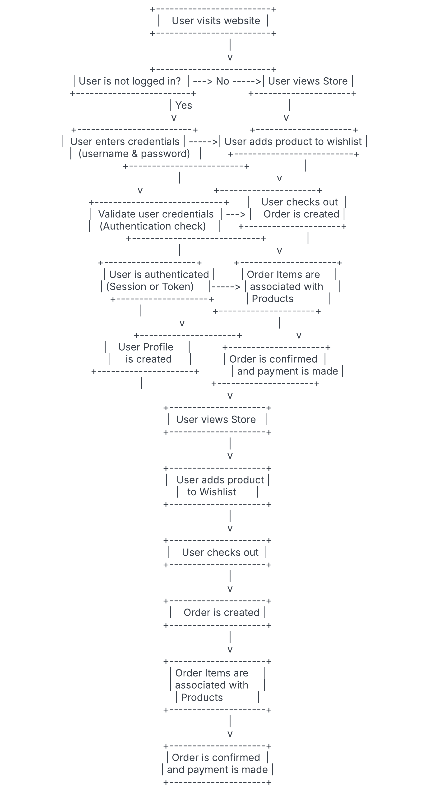
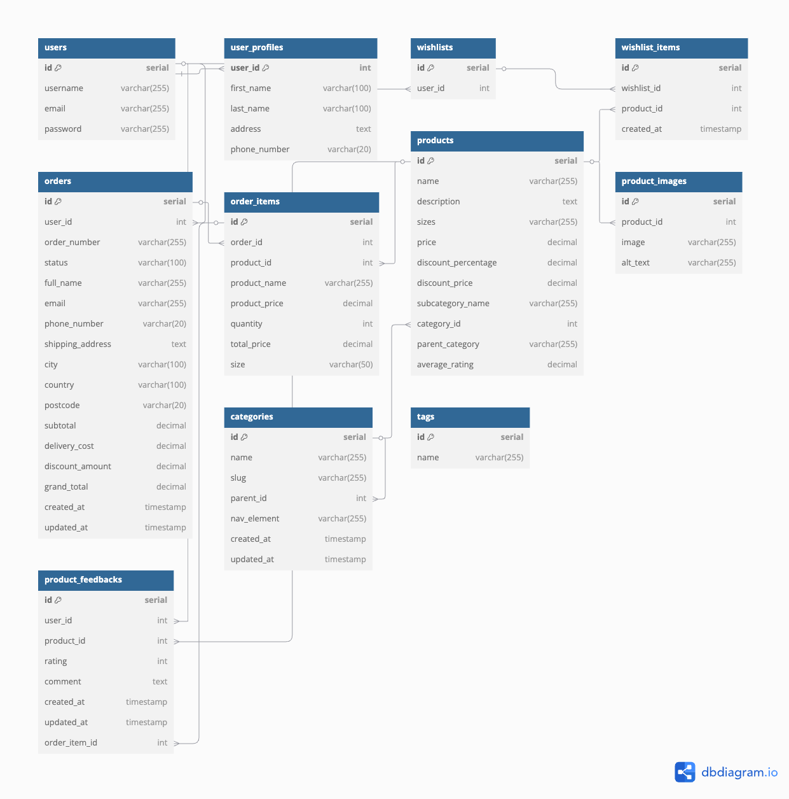

# Motion & Balance

## Live Version
**Deployed website:** [Motion & Balance](https://motion-balance-0321ed00608b.herokuapp.com/)

## Repository
[Motion & Balance Repo](https://github.com/Kevinolm10/Motion-balance)

## Developer
This website is developed by [Kevin Ölmheden](https://github.com/Kevinolm10)

**Card number for payment testing: 4242424242424242**

---

## About

[Motion & Balance](https://motion-balance-0321ed00608b.herokuapp.com/) "Motion & Balance" is an online store offering a wide range of gym clothing and accessories. Our website includes all the essential features for a seamless shopping experience, such as an intuitive login system, a user-friendly shopping cart, an easy checkout process, and a secure payment gateway.

---

## UX

At Motion & Balance, our user experience (UX) is designed with the health-conscious customer in mind, ensuring an intuitive, efficient, and enjoyable journey from browsing to purchase. We understand that our customers prioritize convenience, clarity, and ease of navigation when shopping for gym clothing and accessories, so every detail of our website has been crafted to align with these values.

## Target Audience

The primary target audience for Motion & Balance consists of individuals who are actively engaged in fitness and gym activities. These customers range from casual gym-goers to dedicated fitness enthusiasts. They are looking for high-quality, durable, and comfortable gym wear and accessories to support their active lifestyle. This group values products that enhance their performance and provide comfort during their workouts.

### Strategy
A concise explanation of the user experience goals and design strategies.

---

### User Stories

#### Visitor

| Issue ID | User Story |
|----------|------------|
|[#1](https://github.com/Kevinolm10/Motion-balance/issues/1)| As a visitor, I can create an account using email so that I can log in and access personalized features. |
|[#6](https://github.com/Kevinolm10/Motion-balance/issues/6)| As a visitor, I can navigate the website seamlessly on different screen sizes so that I can have a consistent experience. |
|[#5](https://github.com/Kevinolm10/Motion-balance/issues/5)| As a visitor, I can view the website on any device so that I can browse and shop easily. |

#### User

| Issue ID | User Story |
|----------|------------|
|[#2](https://github.com/Kevinolm10/Motion-balance/issues/2)| As a user, I can log in and log out securely so that my account is protected. |
|[#3](https://github.com/Kevinolm10/Motion-balance/issues/3)| As a user, I can reset my password if I forget it so that I can regain access to my account. |
|[#8](https://github.com/Kevinolm10/Motion-balance/issues/8)| As a user, I can see detailed information about a product so that I can make an informed purchase decision. |
|[#9](https://github.com/Kevinolm10/Motion-balance/issues/9)| As a user, I can filter products by price or category so that I can find relevant items quickly. |
|[#10](https://github.com/Kevinolm10/Motion-balance/issues/10)| As a user, I can add products to a shopping bag so that I can purchase multiple items at once. |
|[#11](https://github.com/Kevinolm10/Motion-balance/issues/11)| As a user, I can view the total cost of items in my shopping bag so that I know how much I need to pay. |
|[#12](https://github.com/Kevinolm10/Motion-balance/issues/12)| As a user, I can proceed to checkout so that I can complete my purchase securely. |
|[#13](https://github.com/Kevinolm10/Motion-balance/issues/13)| As a user, I can add or update my phone number in my profile so that I can receive notifications related to my orders. |
|[#14](https://github.com/Kevinolm10/Motion-balance/issues/14)| As a user, I can view my past ratings and comments in my profile so that I can track my feedback history. |
|[#17](https://github.com/Kevinolm10/Motion-balance/issues/17)| As a user I can add products to my wishlist so that I can save them for later and easily find them again. |
|[#18](https://github.com/Kevinolm10/Motion-balance/issues/18)| As a User I can sign up to a newsletter so that i can recieve news of new products and deals. |

### Admin

| Issue ID | User Story |
|----------|------------|
|[#4](https://github.com/Kevinolm10/Motion-balance/issues/4)| As an admin, I can manage users, including activating/deactivating accounts and assigning superuser privileges, so that I can control access to the site. |
|[#16](https://github.com/Kevinolm10/Motion-balance/issues/16)| As an admin, I can view all user feedback for products so that I can address complaints or highlight popular items. |

*All User stories were created on Github projects*

## Business Model

The Business Model is B2C, meaning that the company sells products to customers only.
It focuses on individual transactions only.

### A Persona Summary of the customer

Motion & Balance’s target customer is a health-conscious, active individual who values high-quality, stylish, and functional gym wear. They seek a seamless online shopping experience with easy navigation, secure checkout, and personalized discounts. They appreciate real-time product availability notifications and expect a brand that aligns with their fitness-driven lifestyle.

### A persona summary of the store personnel

Motion & Balance’s store personnel include admins, managers, logistics staff, and other key team members who ensure smooth operations. They require an intuitive backend system for managing inventory, processing orders, and overseeing customer interactions. Efficiency, scalability, and role-based access are essential for their workflow, allowing them to maintain a seamless shopping experience for customers while handling business logistics effectively.

### Strategy Trade-Off

Motion & Balance balances user-friendly shopping with a powerful management system for store personnel. While ensuring a seamless experience for customers.

- a wide variety of product offerings;
- product availability;
- product quality;
- product choice;
- good user experience;
- good service;
- good sales;
- good customer loyalty;
- unique customer service (customer products' requests);

---

## Web Marketing

1. News Letter

To send newsletters to subscribed customers.
Mailchimp is used to send the newsletter.

2. Facebook

Facebook is a crucial platform for Motion & Balance to connect with customers. Statistics show that the store effectively reaches users who prefer Facebook, making it a valuable channel. With its extensive global presence among online shoppers, Facebook provides excellent opportunities for engagement and sales.

Motion & Balance's Facebook page is for marketing purposes to post adverts and exciting content and engage users.

---

## Future Development

#### Web product management

Product and user management implemented in the web interface with crud functionality is planned. This to provide the store staff with the best ux design and tools to deliver on our brand and products.

#### Crud functionality for all pages

Better Crud operations for all pages including, wishlists and order history.

#### 

---

## Technologies Used
- ### Languages:

+ [Python 3.12](https://www.python.org/downloads/release/python-312/): the primary language used to develop the server-side of the website.
    + [JS](https://www.javascript.com/): the primary language used to develop interactive components of the website.
    + [HTML](https://developer.mozilla.org/en-US/docs/Web/HTML): the markup language used to create the website.
    + [CSS](https://developer.mozilla.org/en-US/docs/Web/css): the styling language used to style the website.

- ### Frameworks and libraries:

+ [Django](https://www.djangoproject.com/): python framework used to create all the logic.
+ [jQuery](https://jquery.com/): was used to control click events and sending AJAX requests.

- ### Databases:

+ [SQLite](https://www.sqlite.org/): was used as a development database.
+ [PostgreSQL](https://www.postgresql.org/): the database used to store all the data.

- ### Other tools:

    + [Git](https://git-scm.com/): the version control system used to manage the code.
    + [Pip3](https://pypi.org/project/pip/): the package manager used to install the dependencies.
    + [Gunicorn](https://gunicorn.org/): the web server used to run the website.
    + [Psycopg2](https://www.psycopg.org/): the database driver used to connect to the database.
    + [Django-allauth](https://django-allauth.readthedocs.io/en/latest/): the authentication library used to create the user accounts.
    + [Django-crispy-forms](https://django-cryptography.readthedocs.io/en/latest/): was used to control the rendering behavior of Django forms.
    + [GitHub](https://github.com/): used to host the website's source code.
    + [VSCode](https://code.visualstudio.com/): the IDE used to develop the website.
    + [Chrome DevTools](https://developer.chrome.com/docs/devtools/open/): was used to debug the website.
    + [Font Awesome](https://fontawesome.com/): was used to create the icons used in the website.
    + [Coolors](https://coolors.co/202a3c-1c2431-181f2a-0b1523-65e2d9-925cef-6b28e0-ffffff-eeeeee) was used to make a color palette for the website.
    + [W3C Validator](https://validator.w3.org/): was used to validate HTML5 code for the website.
    + [W3C CSS validator](https://jigsaw.w3.org/css-validator/): was used to validate CSS code for the website.
    + [JShint](https://jshint.com/): was used to validate JS code for the website.
    + [PEP8](https://pep8.org/): was used to validate Python code for the website.
    + [stripe](https://stripe.com/): was used to create the payment system.
    + [Sitemap Generator](https://www.xml-sitemaps.com/) was used to create the sitemap.xml file.
    + [Privacy Policy Generator](https://www.privacypolicygenerator.info/) was used to create the privacy policy.
    + [Django-extensions](https://django-extensions.readthedocs.io/en/latest/) was used to create a Entity-Relationship Diagram.

---

## Features

Please refer to the [FEATURES.md](FEATURES.md) file for all test-related documentation.

---

## Design Principles

### Color Scheme

The look and feel of the Motion & Balance website is a blend of modern elegance and earthy warmth, designed to resonate with health-conscious customers. The color palette creates a sense of balance, sophistication, and energy, enhancing the shopping experience with a clean, welcoming, and motivating aesthetic.

- Primary Color (#8e9b90 - Muted Sage Green): Brings a sense of calm and stability, reinforcing the brand’s connection to wellness and balance.
- Secondary Color (#d4cdab - Soft Beige): Adds warmth and an organic feel, making the site approachable and inviting.
- Accent Color (#BF4F51 - Deep Red): Injects energy and passion, used strategically to highlight key actions like buttons, sales, or important notifications.
- Text Color (#333 - Dark Gray): Provides strong contrast for easy readability while maintaining a sleek and professional appearance.
- Hover Background (#fff - White): Offers a crisp, fresh effect to enhance interactivity.

  

### Typography

#### The Choice of fonts

The choice of Arial and Poppins as the primary fornts for the Motion & Balance website was driven by readability, brand, identity and user experience considerations. These fonts ensure a professionalism, modern and accessible look that aligns with the company's goals.

Why Arial & Poppins?
Readability & Accessibility

Arial is a widely recognized sans-serif font, known for its clean, easy-to-read structure, making it accessible to all users.
Poppins offers a modern, geometric style that enhances clarity and a smooth reading experience.
Brand Identity & Market Positioning

Poppins gives the site a sleek, contemporary feel, aligning with the fitness industry’s dynamic and aspirational nature.
Arial, being a neutral and professional font, ensures trustworthiness and simplicity, which is crucial for an e-commerce platform.
Consistency Across Devices & Platforms

Both fonts are web-safe, ensuring a consistent and reliable display across all browsers and devices.
This guarantees a seamless shopping experience, reducing distractions and maintaining brand uniformity.
Business Growth & Scalability

A clean and modern typography choice allows for future scalability, ensuring that as the brand grows, the design remains timeless and adaptable.
It works well for marketing materials, social media, and print, reinforcing a strong brand identity across all platforms.
By using Arial and Poppins, Motion & Balance balances functionality, aesthetics, and business strategy, creating a visually appealing, trustworthy, and high-performing e-commerce experience for customers.

---

#### Agile Methodology

 

---

## Wireframes

#### Desktop
- [Desktop home](documentation/wireframes/wireframe-desk-home.png)
- [Desktop products](documentation/wireframes/wireframe-desk-products.png)
- [Desktop product details](documentation/wireframes/wireframe-desk-product-details.png)
- [Desktop empty cart](documentation/wireframes/wireframe-desk-empty-cart.png)
- [Desktop cart items](documentation/wireframes/wireframe-desk-cartitems.png)
- [Desktop checkout](documentation/wireframes/wireframe-desk-checkout.png)
- [Desktop order details](documentation/wireframes/wireframe-desk-order-conf.png)
- [Desktop profile](documentation/wireframes/wireframe-desk-profile.png)
- [Desktop sign in](documentation/wireframes/wireframe-desk-sign-in.png)
- [Desktop sign up](documentation/wireframes/wireframe-desk-sign-up.png)

#### Mobile
- [Mobile home](documentation/wireframes/wireframe-mob-home.png)
- [Mobile menu](documentation/wireframes/wireframe-mob-menu.png)
- [Mobile products](documentation/wireframes/wireframe-mob-products.png)
- [Mobile product details](documentation/wireframes/wireframe-mob-products-details.png)
- [Mobile empty cart](documentation/wireframes/wireframe-mob-cart-empty.png)
- [Mobile cart](documentation/wireframes/wireframe-mob-cart.png)
- [Mobile checkout](documentation/wireframes/wireframe-mob-checkout.png)
- [Mobile order details](documentation/wireframes/wireframe-mob-orderconf.png)
- [Mobile profile](documentation/wireframes/wireframe-mob-profile.png)
- [Mobile sign in](documentation/wireframes/wireframe-mob-signin.png)
- [Mobile sign up](documentation/wireframes/wireframe-mob-signup.png)

---

## Flowcharts

This application is designed to accommodate users with different roles, each having specific expectations and access to distinct functionalities. To provide a clearer picture of how the system operates and how various roles interact with the platform, we’ve created a detailed website functionality flowchart.

The flowchart offers a high-level overview of the user journey across the website, beginning from the user’s first interaction with the platform to navigating the various sections. It highlights the core processes and interactions, ensuring that all users—whether they are visitors, registered users, trainers, or admins—can easily understand how actions are connected within the platform.

- 

---

## Information Architecture

### Database

- This project uses PostgreSQL as the primary database management system (DBMS) to store and manage application data. The database schema has been designed to model the key entities involved in the system, including users, products, orders, and more.

Below is a high-level overview of the database structure:

1. Users and Profiles:

- The users table stores essential information about each user, such as their username, email, and password.

- The user_profiles table extends the users table by including additional fields like first name, last name, address, and phone number.

2. Product Management:

- The products table contains detailed information about the products being sold, including the name, description, price, discount, and category.
- The product_images table stores images associated with each product.
- The product_feedbacks table allows users to leave ratings and comments on products they've purchased.

3. Orders and Wishlist:

- The orders table records user orders, including shipping details, order status, and totals.
- The order_items table links specific products to an order, with details about the product quantity, price, and size.
- The wishlists table allows users to maintain a list of products they wish to purchase, with the wishlist_items table linking specific products to the user's wishlist.

4. Categories and Tags:

- The categories table organizes products into a hierarchical structure, where each category can have a parent category.
- The tags table stores labels or tags that can be associated with products for easier filtering and searching.

5. Relationships:

- Foreign key relationships are used throughout the schema to link tables together. For instance:
- user_profiles.user_id references users.id.
- order_items.order_id references orders.id.
- product_feedbacks.product_id references products.id.

**PostgreSQL Schema**

The schema is designed to ensure referential integrity and optimized data retrieval, with relationships defined using foreign keys. Here's a simplified view of the schema for key tables and relationships:

- Users have one profile (user_profiles).
- Users can have multiple orders and wishlists.
- Orders consist of multiple order_items, and each order_item is linked to a product.
- Products are categorized in a category, and can have multiple product_images and product_feedbacks.

**Database Setup**

To set up the database, follow these steps:

Ensure PostgreSQL is installed and running on your machine or use a cloud PostgreSQL service.

Bash:

Create a new database for the project:

createdb your_database_name

Apply migrations to set up the schema and populate the database with initial data:

python manage.py migrate

Optionally, you can populate the database with some sample data by using Django's fixtures or by manually adding entries through the Django Admin.

### Data Modeling
- 

---

## Testing

Refer to the [TESTING.md](TESTING.md) file for details.

---

## Deployment

- The app was deployed to [Heroku](https://heroku.com/).

- The app can be reached by the [link](https://motion-balance-0321ed00608b.herokuapp.com/).

Please refer to the [DEPLOYMENT.md](DEPLOYMENT.md) file for all deployment and payment-related documentation.

---

## Credits

- [GitHub](https://github.com/) for giving the idea of the project's design.
- [Django](https://www.djangoproject.com/) for the framework.
- [Font awesome](https://fontawesome.com/): for the free access to icons.
- [jQuery](https://jquery.com/): for providing varieties of tools to make standard HTML code look appealing.
- [Postgresql](https://www.postgresql.org/): for providing a free database.
- [Dbdiagram](https://www.dbdiagram.io/): for making it possible to visualise my er diagram from text.
- [Stripe](https://stripe.com/): for providing a free payment gateway.
- [googlefonts](https://fonts.google.com/): for providing free fonts.
- [Responsive Viewer](https://chrome.google.com/webstore/detail/responsive-viewer/inmopeiepgfljkpkidclfgbgbmfcennb/related?hl=en): for providing a free platform to test website responsiveness
- [GoFullPage](https://gofullpage.com/): for allowing to create free full web page screenshots;
- [Favicon Generator. For real.](https://realfavicongenerator.net/): for providing a free platform to generate favicons.
- [Coolors](https://coolors.co/): for providing a free platform to generate your own palette.

### Content and Images

- [chrome developer tools](https://developer.chrome.com/extensions/devtools_inspector): for providing a free platform to test website.
- [FreeImages](https://freeimages.com/): for providing a free products' images.

---

## Acknowledgments

- Special thanks to [Mentor/Team/Supporters].
- Big thanks to my menot Julia!
